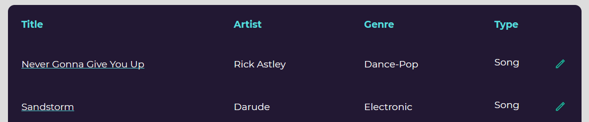

# Music Collections

## A web page for collecting music

Allows users to store info about songs/albums/playlists.

You can search and sort collections by title, artist, etc.

Also allows to share your collections with other people. Just share a link to your collection!

## Tech

Made using django and uses spotipy for parsing info from spotify links.

## Deployement

You need to create a database and create `musiccollection/.env` (look at `.env.example` for inspiration).
